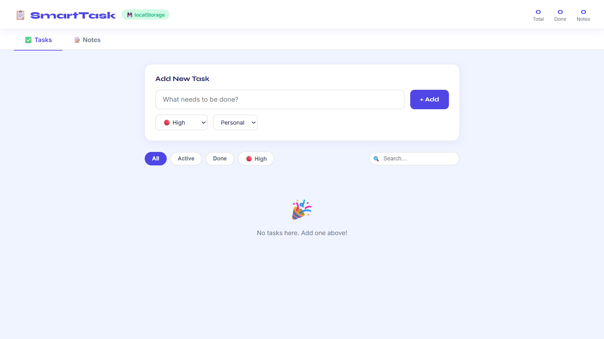
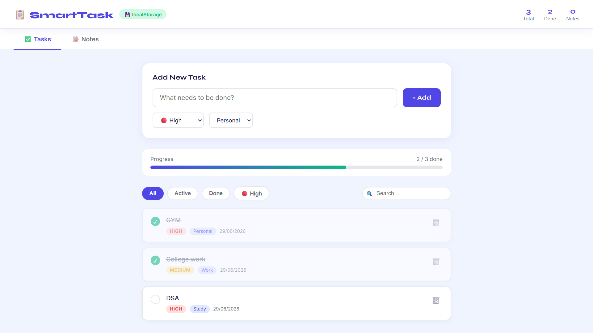
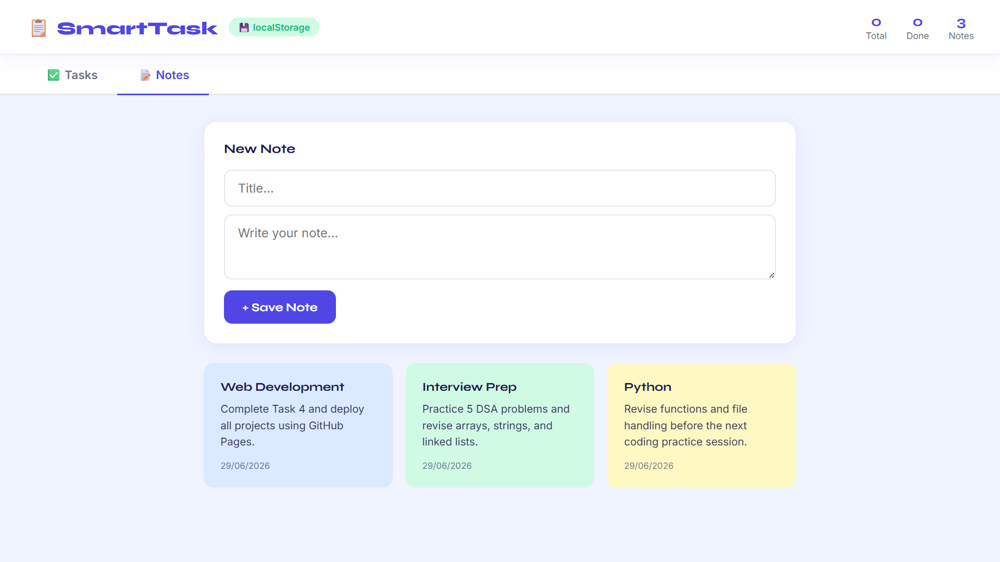

# Smart To-Do & Notes App

A modern and responsive **To-Do & Notes** web application built using **HTML5, CSS3, and Vanilla JavaScript**. It helps users organize tasks efficiently with priorities, categories, notes, and persistent data storage using the **Web Storage API (localStorage)**.

---

## ✨ Features

- ✅ Add, complete, and delete tasks
- 🔥 Priority levels (High, Medium, Low)
- 📂 Task categories (Work, Study, Personal, General)
- 🔍 Real-time task search
- 🎯 Filter tasks by priority and completion status
- 📊 Progress bar showing task completion
- 📝 Sticky Notes section
- 💾 Data persistence using localStorage
- 📱 Fully responsive design

---

## 🛠️ Technologies Used

- HTML5
- CSS3
- Vanilla JavaScript (ES6)
- Web Storage API (localStorage)

---

## 📸 Screenshots

### Dashboard



---

### Task Management



---

### Notes & Progress



---

## 🚀 Live Demo

🌐 https://syed7396.github.io/Smart-Todo-App/

---

## 📁 Folder Structure

```text
Smart-Todo-App/
├── index.html
├── README.md
└── screenshots/
    ├── dashboard.png
    ├── tasks.png
    └── notes.png
```

---

## 👨‍💻 Author

**Syed Adnan**

B.Tech – Information Technology  
Sreenidhi Institute of Science and Technology (SNIST)

📧 7989adnan@gmail.com  
🔗 LinkedIn: https://www.linkedin.com/in/syed13/  
💻 GitHub: https://github.com/syed7396
